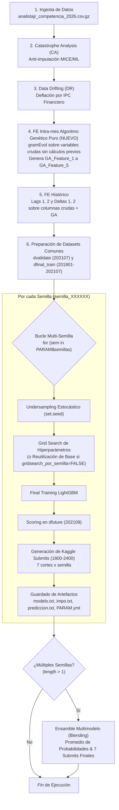

# 🧬 Documentación Técnica: Workflow 01 Junior Grupo A (Algoritmo Genético Puro & Multi-Semilla)
## `620_WorkFlow_01_junior_grupoA_GA_puro.ipynb`

> **Materia:** Minería de Datos en Economía y Finanzas (DMEyF) — Maestría en Ciencia de Datos  
> **Script Base:** [`src/ExpColaborativos/620_WorkFlow_01_junior_grupoA_GA.ipynb`](file:///home/adrian/Maestría/dmeyf/dmeyf2026/src/ExpColaborativos/620_WorkFlow_01_junior_grupoA_GA.ipynb)  
> **Script Generado:** [`src/ExpColaborativos/620_WorkFlow_01_junior_grupoA_GA_puro.ipynb`](file:///home/adrian/Maestría/dmeyf/dmeyf2026/src/ExpColaborativos/620_WorkFlow_01_junior_grupoA_GA_puro.ipynb)  
> **Experimento:** `WF9101`  
> **Estado:** Listo para ejecución en `desktop-jr` y Google Colab  
> **Límite de Subidas Kaggle en la Competencia:** 100 submits por día  

---

## 1. Resumen Ejecutivo y Motivación

El presente documento detalla la arquitectura técnica y el manual operativo del notebook **`620_WorkFlow_01_junior_grupoA_GA_puro.ipynb`**, una variante diseñada para contrastar empíricamente la hipótesis central del **Problema #10 del Grupo A**:

> *"Un algoritmo genético que vaya generando las combinaciones de variables y descarte aquellas que no sean de utilidad debe ser mucho mejor que las variables que se nos puedan ocurrir o que la bibliografía acerca del sector financiero pueda plantear."*

### Diferencia Fundamental: Versión Híbrida vs. Versión Pura

| Característica | Versión Híbrida (`WF9100` / `_GA.ipynb`) | Versión Pura (`WF9101` / `_GA_puro.ipynb`) |
| :--- | :--- | :--- |
| **Cálculos Previos Manuales** | **Sí (22 variables)** organizadas en 6 familias financieras (tarjetas, payroll, sobregiro, tickets). | **No (0 variables manuales)**. Se eliminan todas las reglas fijas previas. |
| **Población Terminal del GA** | Variables crudas + variables manuales precalculadas ("Warm Start"). | **Exclusivamente las variables numéricas crudas** del banco (tras Catastrophe Analysis y Data Drifting). |
| **Origen del Feature Engineering** | Cooperativo: Intuición humana de negocio + optimización evolutiva. | **Autónomo:** El algoritmo genético (`gramEvol`) asume la responsabilidad total del descubrimiento no lineal. |
| **Identificador del Experimento** | `PARAM$experimento <- 9100` | `PARAM$experimento <- 9101` |

---

## 2. Diagrama de Flujo del Pipeline Puro



---

## 3. Matriz Comparativa Tripartita

| Etapa / Componente | Baseline Canónico (`620_...junior_grupoA.ipynb`) | Versión Híbrida (`620_..._GA.ipynb`) | Versión Pura (`620_..._GA_puro.ipynb`) |
| :--- | :--- | :--- | :--- |
| **Experimento** | `WF9100` | `WF9100` | **`WF9101`** |
| **FE Intra-mes Manual** | 2 variables (`kmes`, `mpayroll_sobre_edad`) | 22 variables en 6 familias de negocio | **Ninguna (0 variables manuales)** |
| **Algoritmo Genético** | No implementado | Evolución Gramatical con terminales mixtos | **Evolución Gramatical Pura sobre variables crudas** |
| **Features Sintéticas** | Ninguna | 22 manuales + Top 5 GA (`GA_Feature_1..5`) | **Top 5 GA (`GA_Feature_1..5`) exclusivamente** |
| **Sobrecarga en Lags** | Mínima (80 vars) | Moderada (~107 vars antes de lags) | **Baja y controlada (~85 vars antes de lags)** |
| **Evaluación de Fitness** | N/A | LightGBM univariado local (50k sample) | **LightGBM univariado local (50k sample)** |
| **Automatización Multi-Semilla** | Manual (1 sola semilla) | Bucle multi-semilla modularizado | **Bucle multi-semilla modularizado** |
| **Ensamble Blending** | No disponible | Promedio de probabilidades multi-semilla | **Promedio de probabilidades multi-semilla** |
| **Blindaje Anti-Leakage** | N/A (Sin GA previo) | Vulnerable (riesgo clase01_delta1) | **Blindaje Defensivo en 3 Capas (Aislamiento volátil + exclusión lags + regex)** |

---

## 4. Arquitectura Técnica del Algoritmo Genético Puro

### 4.1 Selección de Terminales Crudas
El algoritmo extrae automáticamente las variables numéricas originales del banco:
1. Excluye identificadores, metadatos y target: `numero_de_cliente`, `foto_mes`, `clase_ternaria`, `clase01`, `azar`.
2. Filtra únicamente columnas con tipo `is.numeric`.
3. Excluye variables de fechas (prefijos o sufijos `fecha`, `_f`).
4. Si la cantidad de variables supera `MAX_TERMINALES = 60` (fijado en 60 para forzar el uso de la totalidad de las 54 variables numéricas crudas del dataset), realiza un muestreo pseudo-aleatorio reproducible usando `PARAM$semilla_primigenia`.

### 4.2 Gramática Formal BNF (Backus-Naur Form)
Se define una gramática contextual que asegura expresiones sintácticamente válidas en R:
```text
<expr> ::= <op>
<op>   ::= <op> + <op> | <op> - <op> | <op> * <op> | protected_div(<op>, <op>) | protected_log_diff(<op>, <op>) | <var>
<var>  ::= col_1 | col_2 | ... | col_54
```

### 4.3 Operadores Aritméticos Protegidos
Para garantizar que ninguna expresión produzca `Inf`, `-Inf` o `NaN`:
```r
protected_div <- function(x, y) {
  res <- x / (y + 1e-5)
  res[is.na(res) | is.infinite(res)] <- 0
  res
}

protected_log_diff <- function(x, y) {
  res <- log(abs(x - y) + 1)
  res[is.na(res) | is.infinite(res)] <- 0
  res
}
```

### 4.4 Función de Aptitud (Fitness) Eficiente
1. **Split Local Temporal:** Para evitar contaminación (*data leakage*), el algoritmo evalúa la aptitud exclusivamente en meses anteriores a `202107` (el mes de validación oficial del workflow). Se toman los últimos 3 meses históricos disponibles como validación local (`idx_val_GA`) y los meses precedentes como entrenamiento local (`idx_tr_GA`).
2. **Subsampling de Alto Rendimiento:** Se limita la evaluación de aptitud a una muestra estratificada de hasta $50.000$ filas de entrenamiento y $25.000$ de validación. Esto reduce el tiempo por individuo a **~5 milisegundos**, permitiendo que una población de $150$ individuos a lo largo de $50$ generaciones concluya en **~2 a 4 minutos**.
3. **Métrica de Costo:**
   $$\text{Fitness Cost} = 1 - \text{AUC}_{\text{LightGBM Univariado}}$$
   (donde menor costo indica mejor capacidad predictiva univariada).

### 4.5 Mapeo Genotipo -> Fenotipo y Filtro Antirredundancia
Al concluir las generaciones evolutivas:
* Se mapea cada individuo de la población final mediante `GrammarMap()`.
* Se filtran fórmulas no terminales o con costo nulo/inválido.
* Se descartan **expresiones triviales** (variables solitarias sin combinaciones aritméticas) mediante la función:
  ```r
  es_expresion_trivial <- function(f) { !grepl("[+*/-]|protected_", f) }
  ```
* Se inyectan en `dataset` las mejores 5 fórmulas únicas: `GA_Feature_1`, `GA_Feature_2`, `GA_Feature_3`, `GA_Feature_4` y `GA_Feature_5`.

### 4.6 Presión Selectiva Evolutiva Aumentada (Elitismo y Diversidad)
Para forzar a la descendencia a superar el rendimiento de las mejores soluciones y evitar la pérdida de avances genéticos:
* **Elitismo al 50% (`elitism = as.integer(PARAM$GA$popSize * 0.50)`):** Preserva el 50% superior de la población entre generaciones, obligando a los nuevos individuos recombinados a desbancar a los progenitores de élite para progresar.
* **Tasa de Mutación (`mutationChance = 0.15`):** Introduce una probabilidad del 15% de mutación por codón/individuo, promoviendo diversidad genética y evitando el estancamiento en óptimos locales.

### 4.7 Trazabilidad Completa de Variables Descubiertas (CSV)
Durante la fase de inyección de variables, se registra de forma rigurosa la procedencia de cada feature sintética:
* Se inicializa una tabla estructurada: `dt_trazabilidad <- data.table(Variable=character(), AUC=numeric(), Formula=character())`.
* Tras inyectar cada variable válida a `dataset`, se asienta el registro con `dt_trazabilidad <- rbind(dt_trazabilidad, list(nombre_col, scores_finales[i], formulas_finales[i]))`.
* Al finalizar el bucle, se exporta a disco con `fwrite(dt_trazabilidad, file = file.path(dir_experimento_base, paste0("GA_trazabilidad_formulas_s", PARAM$semilla_primigenia, ".csv")), sep = ",")`.

### 4.8 Blindaje Anti-Leakage (Protección Estricta del Target Temporal)

Durante la inspección técnica profunda de versiones experimentales preliminares (`v2`), se detectó un grave efecto colateral inadvertido:
* Para computar el fitness en el Algoritmo Genético, se creaba prematuramente la columna `clase01` en `dataset`.
* Al no ser eliminada antes del paso de Feature Engineering Histórico (`FEhist`), el motor generaba deltas temporales del target: `clase01_delta1 = clase01[t] - clase01_lag1[t-1]`.
* Como casi la totalidad de clientes que causan baja en $t$ estaban activos en $t-1$ (`clase01_lag1 = 0`), `clase01_delta1` reproducía con precisión perfecta el target actual (`1 - 0 = 1` para BAJA; `0 - 0 = 0` para CONTINUA).
* LightGBM aprendió a usar esta variable filtrada durante el Grid Search, alcanzando un **AUC artificial de 0.999998 (Data Leakage total)**, provocando predicciones vacías o erróneas en Kaggle (`202109`, donde no hay target).

En este script de producción se implementa un **blindaje defensivo en 3 capas**:
1. **Aislamiento Volátil del Target en GA:** El fitness ya no inyecta `clase01` en `dataset`. Computa los vectores de evaluación directamente en memoria volátil:
   ```r
   y_tr_GA  <- ifelse(dataset$clase_ternaria[idx_tr_GA] %in% c("BAJA+1", "BAJA+2"), 1L, 0L)
   y_val_GA <- ifelse(dataset$clase_ternaria[idx_val_GA] %in% c("BAJA+1", "BAJA+2"), 1L, 0L)
   ```
   Y al finalizar la celda se aplica la remoción explícita preventiva:
   ```r
   if ("clase01" %in% colnames(dataset)) dataset[, clase01 := NULL]
   ```
2. **Blindaje en `cols_lagueables` (FEhist):** Se añade explícitamente `clase01` a las variables excluidas de retardos temporales:
   ```r
   cols_lagueables <- copy(setdiff(
       colnames(dataset),
       c("numero_de_cliente", "foto_mes", "clase_ternaria", "clase01", "azar")
   ))
   ```
3. **Filtro Regex Defensivo en `campos_buenos` (Modelado):** Se excluye cualquier predictor que comience con `"clase"` antes de ingresar a LightGBM:
   ```r
   campos_buenos <- copy(setdiff(
       colnames(dataset), c("clase_ternaria", "clase01", "azar", "fold_train", "fold_final_train")
   ))
   campos_buenos <- campos_buenos[!grepl("^clase", campos_buenos)]
   ```

---

## 5. Parámetros de Configuración (`PARAM$GA`)

En la Celda 11 del notebook se parametrizan todas las dimensiones del algoritmo genético para abarcar la totalidad de variables y elevar la presión evolutiva:

```r
PARAM$GA <- list(
  popSize = 150,            # Tamaño de la población de individuos
  iterations = 50,          # Cantidad de generaciones evolutivas
  top_features = 5,         # Cantidad de mejores features no lineales a inyectar
  max_terminales = 60,      # Forzar a usar todas las variables (54 variables crudas)
  seqLen = 250,             # Longitud máxima de codones del genoma
  max.depth = 10,           # Profundidad máxima del árbol sintáctico BNF
  max_filas_fitness = 50000 # Subsampling para evaluación de fitness ultrarrápida
)
```

### 5.1 Bloque de Ejecución GrammaticalEvolution
```r
ge_res <- GrammaticalEvolution(
  grammarDef      = bnf_grammar,
  evalFunc        = fitness_gramEvol,
  popSize         = PARAM$GA$popSize,
  iterations      = PARAM$GA$iterations,
  terminationCost = 0.10,
  seqLen          = PARAM$GA$seqLen,
  max.depth       = PARAM$GA$max.depth,
  
  # Nuevos parámetros de presión selectiva
  elitism         = as.integer(PARAM$GA$popSize * 0.50),
  mutationChance  = 0.15,
  
  monitorFunc     = function(result) {
    cat(sprintf("Gen %2d | Mejor Costo: %.5f (AUC: %.5f)\n",
                result$population$currentIteration,
                result$best$cost,
                1 - result$best$cost))
  }
)
```

---

## 6. Automatización Multi-Semilla y Salidas en Disco

### 6.1 Estructura de Carpetas Generada (`WF9101`)

```text
/content/buckets/b1/exp/WF9101/
│
├── GA_trazabilidad_formulas_s115879.csv    <-- Trazabilidad de variables, AUC y fórmulas genéticas
├── semilla_115879/
│   ├── tb_grid_search_01.txt       <-- Grid search con features puras de GA
│   ├── modelo.txt                  <-- Modelo LightGBM serializado
│   ├── impo.txt                    <-- Importancia de features (evaluar rank de GA_Feature_X)
│   ├── prediccion.txt              <-- Probabilidades estimadas 202109
│   ├── PARAM.yml                   <-- Metadatos y parámetros
│   └── kaggle/
│       ├── KA9101_s115879_1800.csv
│       ├── ... (cortes hasta 2400)
│
├── semilla_197441/
│   └── ...
├── semilla_586051/
│   └── ...
├── semilla_153953/
│   └── ...
├── semilla_874537/
│   └── ...
│
├── prediccion_ensemble.txt         <-- Blending promedio de probabilidades
└── kaggle_ensemble/                <-- Submissions consolidadas del ensamble
    ├── KA9101_ensemble_5sem_1800.csv
    └── ... (hasta 2400)
```

---

## 7. Preguntas de Investigación y Comparación de Modelos

Al comparar los resultados en Kaggle de `WF9100` (Híbrido) vs. `WF9101` (Puro), se responderán las siguientes incógnitas del negocio:
1. **¿Aparecen las `GA_Feature_X` en el Top 20 de `impo.txt`?** Si una variable evolucionada supera en ganancia a variables históricas consolidadas, el algoritmo descubrió una relación de alto valor.
2. **¿Supera el ensamble de `WF9101` al baseline sin FE?** Evalúa la potencia de la síntesis matemática autónoma frente al dataset original.
3. **¿Cómo se compara con el FE manual de dominio (`WF9100`)?** Determina si la intuición de negocio de banca minorista sigue superando a la búsqueda heurística de fuerza bruta o si se complementan.
